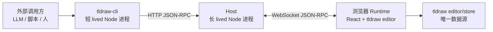
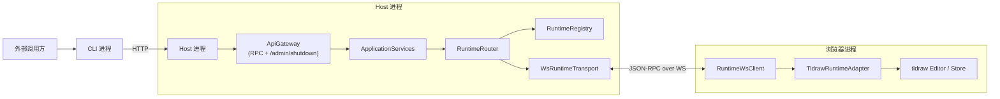
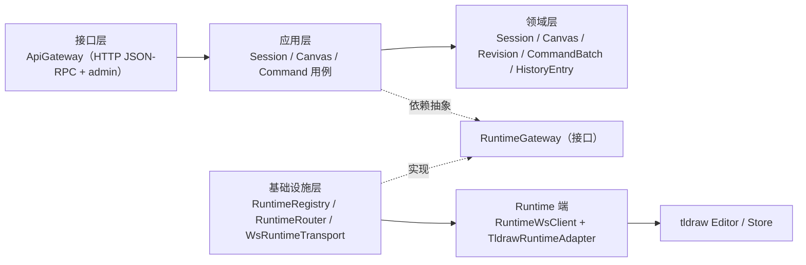

# tldraw-cli 架构设计

## 一、项目定位与目标

tldraw-cli 基于 tldraw 官方 `agent-starter-kit` 重构而来，定位是**把正在运行的 tldraw 画布包装成一个可被外部程序调用的本地工具**。外部程序指：LLM（通过 skill 子进程调用）、shell 脚本、自定义 SDK，均以同一份 CLI 契约为入口。

核心使用场景：

- **LLM skill 调用**：Claude Code / Codex 之类把 `tldraw-cli` 当外部工具，用子命令完成"开画布 / 看画布 / 画画布 / 收增量 / 关画布"闭环
- **人机共画**：浏览器里的 tldraw runtime 是真实画布，用户用鼠标操作；LLM 通过 CLI 并发写入；双方共用同一份 editor/store 状态
- **自动化脚本**：开发者用 shell / Node 脚本批量操作画布，不嵌入 LLM 也能用

**非目标**（本设计不覆盖）：

- 远程多租户 / 多 Host 部署（第一版仅 loopback）
- tldraw editor 以外的画布引擎适配
- 画布内容的长期持久化（交给 tldraw 自带的 `persistenceKey`）
- 聊天式 agent UI（starter 原生功能作为参考保留，不暴露为产品接口）

## 二、整体架构

### 2.1 三端模型



| 端 | 进程类型 | 主要职责 | 生命周期 |
|---|---|---|---|
| CLI | 短 lived Node | 参数解析 / 本地生命周期命令 / Host RPC 适配 | 每条命令一次，执行完即退 |
| Host | 长 lived Node | 公共 RPC 边界 / runtime 路由 / 系统状态 | `tldraw-cli start` 拉起到 `tldraw-cli stop` |
| Runtime | 浏览器标签 | 执行画布操作 / 承载用户交互 / 响应 Host 方法调用 | 用户打开浏览器到关闭标签 |

三端在**不同进程**中运行，通信全部显式、无共享内存。

### 2.2 通信协议

两段独立的 JSON-RPC 2.0 链路：

- **CLI ↔ Host**：HTTP POST `/rpc`。无状态、请求-响应。让 CLI 每次可起一个新进程、调一次、干净退出（契合 LLM skill 的一次性调用模型）。另有 `POST /admin/shutdown` 本地管理端点。
- **Host ↔ Runtime**：WebSocket 长连，双向 JSON-RPC。Host 侧主动发请求、Runtime 执行后回。握手时 Runtime 上报 capability；Host 退出前发 `session.shutdown` 通知。

### 2.3 部署形态



### 2.4 技术栈选型

| 组件 | 选用 | 理由 |
|---|---|---|
| 语言 | TypeScript 5.8（`strict`） | 与 starter 一致；强类型覆盖 RPC schema |
| CLI 框架 | `@stricli/core` | 类型安全的子命令树、flags 声明式、LocalContext 依赖注入 |
| 打包 | `rolldown` | Rust 实现、原生 TS、输出 ESM bundle 作为 npm bin |
| Node WebSocket | `ws` | 事实标准、零配置 |
| HTTP | Node 内置 `http` | 仅两个端点，无需引入 express |
| Schema | `zod@4` | 与 starter 一致；schema 同时用于校验 + 类型推导 |
| 浏览器 runtime | `react` + `tldraw` | 复用 starter 页面，不另起前端 |
| 测试 | `vitest` | 原生 ESM、与 Vite 共享配置 |
| 本地 dev | `tsx` | Node 直接跑 TypeScript |

## 三、顶层目录 / 开发 / 构建 / 分发

### 3.1 目录结构

```
tldraw-cli/
├── cli/                  # CLI 适配层（tldraw-cli bin 的源码）
│   ├── main.ts           # stricli application 入口
│   ├── context.ts        # LocalContext
│   ├── commands/         # start / stop / status / canvas / command
│   └── hostClient/       # JsonRpcClient / sessionFile / openBrowser / readStdin
├── host/                 # Host Node 进程
│   ├── HostProcess.ts    # bootstrap
│   ├── ApiGateway.ts     # HTTP JSON-RPC + /admin/shutdown
│   ├── ApplicationServices/
│   ├── domain/
│   └── infra/            # RuntimeGateway / Registry / Router / WsRuntimeTransport
├── client/runtime/       # 浏览器端新增代码
│   ├── RuntimeWsClient.ts
│   ├── RuntimeAdapter.ts
│   ├── TldrawRuntimeAdapter.ts
│   └── RuntimeMount.tsx
├── client/               # starter 原生 React app（作为实现参考）
├── shared/rpc/           # 协议契约单一来源（envelope / methods / errors / capability）
├── shared/               # starter 原生共享代码
├── worker/               # starter 原生 Cloudflare Worker（不在 CLI 边界内）
├── docs/superpowers/     # spec / plan
├── scripts/              # Vite 插件辅助
├── dist/                 # rolldown 产物（cli.mjs / host.mjs）
└── package.json          # bin: "tldraw-cli": "dist/cli.mjs"
```

### 3.2 开发脚本

- `npm run dev` —— 启动 Vite 前端（5173 端口）
- `npm run host` —— `tsx host/HostProcess.ts`，启动 Host 进程
- `npm run cli -- <cmd>` —— 直接跑 CLI，不经 bundle
- `npm run test` / `npm run test:watch` —— vitest
- `npm run build` —— Vite 打包前端
- `npm run build:cli` —— rolldown 打包 CLI + Host

### 3.3 构建与分发

- rolldown 产出两个 ESM bundle：`dist/cli.mjs`（带 `#!/usr/bin/env node`）+ `dist/host.mjs`
- `package.json.bin` 注册 `tldraw-cli`；全局 `npm install -g` 后 `tldraw-cli` 可直接调用
- 前端作为浏览器页面随仓库发布；第一版假定用户本地起 Vite dev server

## 四、CLI 适配层

### 4.1 命令结构

```
tldraw-cli
├── start / stop / status       # 本地生命周期命令（不走 RPC）
├── canvas
│   ├── list                    # → canvas.list
│   ├── snapshot [--canvas ID]  # → canvas.snapshot
│   ├── diff --since N [--canvas ID]  # → canvas.diff
│   ├── create [--title NAME]   # → canvas.create
│   └── select --canvas ID      # → canvas.select
└── command
    └── apply [--canvas ID]     # → command.apply（stdin JSON body）
```

顶层把"进程生命周期"与"画布操作"分开：前者是本地命令，后者是 Host RPC 的薄适配。

### 4.2 本地命令（不走 RPC）

这三条命令**不依赖 Host**（`start` 的时候 Host 还没起），用 pid 文件 + 本地端点协作：

| 命令 | 行为 |
|---|---|
| `start` | 检查 `~/.tldraw-cli/session.json`，若 pid 仍活则拒绝；否则 `spawn` Host 子进程、`waitForPort` HTTP 就绪、写 session 文件、`openBrowser` 打开 Vite 页面 |
| `stop` | 读 session 文件；`POST /admin/shutdown`；等进程退出（5 s）；超时 `SIGTERM` 兜底；清理 session 文件 |
| `status` | 读 session 文件；无 → `{ state: 'not-running' }`；有但 pid 死 → `{ state: 'stale' }` 清理；正常 → 调 RPC `session.status` 合并输出 |

`POST /admin/shutdown` 只绑 `127.0.0.1`，第一版不加 AuthN；远程部署前需替换为经认证的 RPC 方法。

**shutdown 全链路**：

1. CLI `stop` 发 `POST /admin/shutdown`
2. Host `ApiGateway.onShutdown` → `HostProcess.stop`
3. `WsRuntimeTransport.broadcastShutdown` 给所有 runtime 发 `{ type: 'session.shutdown', reason }`
4. 浏览器 `RuntimeWsClient` 收到 → 标记 closed、停止重连、回调 `onShutdown`
5. `RuntimeMount` 用 tldraw 的 `useToasts` 弹一条"Host 已停止，画布只读。请手动关闭此标签"
6. Host 等 100 ms → close WS server → close HTTP server → `process.exit(0)`
7. CLI 等 pid 退出 → 清 session 文件 → 输出结果

**浏览器标签由用户手动关**，CLI 不调用 `window.close()`。

### 4.3 RPC 适配命令

`canvas.*` / `command.apply` 是 HTTP POST 到 `http://127.0.0.1:<port>/rpc` 的薄封装：

- 把 flags 映射为 RPC params；缺省时让 Host 侧回落（active canvas）
- JSON pretty print 结果到 stdout
- 非零 exit code 代表错误，stderr 写 message

`--canvas` 省略时的回落顺序（Host 侧判断）：
1. stdin body 里的 `canvasId`（仅 `command.apply`）
2. `editor.getCurrentPageId()`（active page）

## 五、Host 架构（内部）

### 5.1 逻辑分层



依赖方向：

- 实线 `A --> B`：`A` 依赖 `B`
- 虚线 `依赖抽象` / `实现`：DIP，应用层依赖 `RuntimeGateway` 抽象，基础设施层实现
- 领域层不依赖其它层；接口层与基础设施层不互相依赖

### 5.2 模块职责

| 模块 | 层 | 职责 | 不做 |
|---|---|---|---|
| `HostProcess` | bootstrap | 配置加载、端口绑定、依赖注入、优雅 shutdown | 业务规则、路由 |
| `ApiGateway` | 接口层 | JSON-RPC envelope 解码、schema 校验、domain error 映射、`/admin/shutdown` 入口 | 业务规则、直连 runtime |
| `ApplicationServices` | 应用层 | 用例编排（session / canvas / command） | 协议 / 传输 |
| `Domain Layer` | 领域层 | `Session` / `Canvas` / `Revision` / `CommandBatch` / `HistoryEntry` 模型 | 依赖框架或传输 |
| `RuntimeRegistry` | 基础设施 | runtime 注册 / 心跳 / 能力声明 / 下线 | 选 runtime、发业务请求 |
| `RuntimeRouter` | 基础设施 | 按请求上下文选一条 `RuntimeGateway` | 维护连接状态 |
| `RuntimeGateway` | 基础设施（接口） | 面向应用层的单 runtime 通信抽象 | 业务 |
| `WsRuntimeTransport` | 基础设施（实现） | WebSocketServer + `broadcastShutdown` + Gateway 实现 | 业务 |

### 5.3 传输抽象契约

应用层只依赖 `RuntimeGateway` 接口，WebSocket 只是一种实现：

```ts
export type RuntimeId = string & { readonly _brand: 'RuntimeId' }
export type GatewayState = 'connecting' | 'ready' | 'closing' | 'closed'

export interface RuntimeCapability {
	methods: string[]
	protocolVersion: string
	flags: string[]
	schemaFingerprint: string
}

export interface RequestOptions {
	signal?: AbortSignal
	timeoutMs?: number
	idempotencyKey?: string
	traceparent?: string
}

export interface RuntimeGateway {
	readonly id: RuntimeId
	readonly capability: RuntimeCapability
	readonly state: GatewayState
	request(method: string, params: unknown, options?: RequestOptions): Promise<unknown>
	close(reason?: string): Promise<void>
}

export interface RuntimeTransport {
	readonly kind: 'ws' | 'in-process' | string
	connect(endpoint: unknown, signal?: AbortSignal): Promise<RuntimeGateway>
}
```

约束：

- 每次 `request` 默认幂等或可重试；非幂等方法由应用层决定是否重试
- `close` 必须先等 inflight 请求按默认超时结束或取消，再断链

## 六、浏览器 Runtime

### 6.1 职责分离

| 角色 | 只负责 | 不负责 |
|---|---|---|
| `RuntimeWsClient` | WS 建连 / 重连 / JSON-RPC envelope 编解码 / 请求 id / cancel 帧 / 收 `session.shutdown` | 业务方法语义、editor API、schema 校验 |
| `TldrawRuntimeAdapter` | `(method, params, ctx) → result` 的业务翻译、editor 操作、revision / history 维护 | WS / envelope / 重连 |

组合点：

```ts
const adapter = new TldrawRuntimeAdapter(editor)
const client = new RuntimeWsClient({
	url, adapter, methods,
	onShutdown: (reason) => showToast(reason),
})
```

服务端 `RuntimeGateway.request(...)` 与浏览器端 `TldrawRuntimeAdapter.invoke(...)` 签名对称；换传输（进程内测试）时 adapter 不动。

### 6.2 与 tldraw editor 的关系

`TldrawRuntimeAdapter` 持有 `editor: Editor` 引用：

- 读方法（`canvas.list / snapshot / diff`）走 editor 的 getter（`getPages` / `getCurrentPageShapes` / `getCurrentPageId`）+ adapter 自己维护的 revision + history entries
- 写方法（`canvas.create / select / command.apply`）调 editor mutation（`createPage` / `setCurrentPage` / `createShape`），都包在 `editor.batch()` 里保证原子性
- revision 与 history entries 存在 `Map<canvasId, { revision, history }>` 里，per-canvas

### 6.3 挂载与人机共画

`RuntimeMount` 是一个 React 组件：用 `useEditor()` 拿 editor → 构造 adapter 与 `RuntimeWsClient` → 挂在 `<Tldraw>` 内作为 children。默认 WS URL `ws://127.0.0.1:8788`。

**不干扰用户手动操作**：

- LLM 经 CLI 写 shape → editor 状态变 → 用户看到
- 用户鼠标画 shape → editor 状态变 → LLM 下次 `canvas.snapshot` 看到
- 两端共用同一份 `editor.store`；并发由 tldraw 自己的操作序列化决定

## 七、规范 RPC 方法

第一版稳定能力表面由下列方法定义：

- `session.status`
- `canvas.list`
- `canvas.snapshot`
- `canvas.diff`
- `canvas.create`
- `canvas.select`
- `command.apply`

命名规则 `<resource>.<verb>`。两个 `resource`（`session` / `canvas`）为闭集，新增 `resource` 视为架构级改动；同一 `resource` 下新增 `verb` 视为小改，走能力协商（第八节）暴露。

`session.start` / `session.stop` **不是 RPC 方法**——start 的时候 Host 还没启动，RPC 无处可发。它们是 CLI 本地命令（第四节）。

所有对外接口（RPC / REST / CLI）都映射到这组方法，不围绕同一能力维护多份平行实现。

## 八、RPC 扩展机制

### 8.1 版本协商（握手阶段）

```
client  → server: { protocolVersion: "1", desired: ["canvas.snapshot.viewport", ...] }
server  → client: { protocolVersion: "1", supported: [...], deprecated: [...] }
```

- `protocolVersion` 标识 envelope / 握手协议大版本
- `supported` 为当前 runtime 支持的细粒度能力 flag
- `deprecated` 列将要移除的能力，允许调用但响应 meta 带 deprecation 提示

### 8.2 细粒度能力 flag

方法参数的向后不兼容演进不新开方法名，而是用 flag 表达：

- `canvas.snapshot` 新增可选 `viewport` 参数 → flag `canvas.snapshot.viewport`
- 客户端按握手返回的 `supported` 判断是否使用

**禁止**：`canvas.snapshot@v2` / `canvas.snapshotV2` 这类方法名内嵌版本，会让方法表碎片化。

### 8.3 实验性方法

- 统一前缀 `experimental.*`，文档明确"不保证稳定"
- 稳定后改为规范命名，过渡期双挂 + `meta.deprecation`

### 8.4 废弃策略

响应 envelope 允许携带：

```ts
meta: {
	deprecation?: {
		method: string
		replacement?: string
		removeAt?: string  // ISO date
	}
}
```

不抛错、不阻塞，仅提醒。SDK 可把它转成日志或编译期告警。

## 九、并发与事务语义

### 9.1 revision

- `revision` 为 **per-canvas、单调非减** 整数，由 editor/store 侧发号（第一版由 adapter 维护）
- 跨 canvas 的 revision 不可比较
- `canvas.snapshot` / `canvas.diff` 返回的 revision 同源
- **已知限制**：第一版 revision 只在 runtime 生命周期内有效。runtime 重连或 Host 重启后 revision 归零；LLM 必须用 `canvas.snapshot` 重建基线

### 9.2 history entries（`canvas.diff` 基础）

每次 `command.apply` 成功后，adapter 为新 revision push 若干 `HistoryEntry`；`canvas.diff` 根据 `since` 过滤。

条目 schema 为 discriminated union：

```ts
type HistoryEntry =
	| { kind: 'shape-created'; revision: number; shapeId: string; x: number; y: number; w: number; h: number; geo: 'rectangle' | 'ellipse' }
	// 后续扩展：shape-updated / shape-deleted / page-created / page-deleted / ...
```

第一版仅 `shape-created`（因 `command.apply` 只支持 `create-geo-shape`）。

### 9.3 写冲突（CAS，接口预留）

- `command.apply` 参数含 `expectedRevision?: number`
- 第一版**接收但不检查**（last-write-wins），接口契约已预留
- 后续启用：revision 不匹配 → 返回 `revision_conflict`，响应体带 `currentRevision`，调用方 rebase 后重试

### 9.4 命令原子性

- `command.apply` 的 `commands` 数组视为一个 editor history entry：全部落地 or 全部不落地（第一版用 `editor.batch()` 保证）
- 任一命令失败，整个 apply 返回失败，editor 状态不变

### 9.5 部署假设

- 第一版假定**单 Host 实例 + 单 writer**
- 不处理多 Host 的分布式一致性；后续扩展需独立 spec

## 十、横切关注点

| 关注点 | 所在层 | 第一版 |
|---|---|---|
| 认证 AuthN | `ApiGateway` | loopback 默认关；远程场景需 token，留到后续 |
| 鉴权 AuthZ | `ApplicationServices` | 本地 CLI 默认 `*`；capability 模型留到后续 |
| 结构化日志 | 每层 + 公共 logger | 接口预留，第一版 `console.log` 最小化 |
| 链路追踪 | 全链路 | `RequestOptions.traceparent` 字段预留，不实现 |
| Metrics | Host 出口 | 接口预留，不实现 |
| 错误模型 | `ApiGateway` 统一映射 | 固定 error code 表（`invalid_params` / `runtime_unavailable` / `revision_conflict` / `timeout` / `canvas_not_found` / `method_not_found` / `internal`） |
| 超时 | `RuntimeGateway` | 默认 30 s |
| 重试 | 应用层 | 第一版不自动重试 |
| 幂等 | `ApplicationServices` | `idempotencyKey` 字段接收但不去重 |
| 取消 | 全链路 | `AbortSignal` 在 `RuntimeGateway` 层实现；WS 协议预留 cancel 帧（第一版不发） |
| 背压 | `RuntimeGateway` | inflight 上限不做限制 |
| 限流 | `ApiGateway` | 第一版不限流 |
| Schema 协商 | 接口层 + runtime | 固定 `SCHEMA_FINGERPRINT = 'mvp-v1'`；不做指纹比对 |
| 配置 | `HostProcess` | 固定端口（8787 / 8788） |
| 生命周期 | `HostProcess` | 实现：SIGTERM → 广播 `session.shutdown` → drain → close WS → close HTTP → exit |
| 审计 | 可选 | 不实现 |

## 十一、典型请求流程

以 `command.apply` 为例：

1. LLM 调 `tldraw-cli command apply`，CLI 从 stdin 读 JSON body
2. CLI 的 `JsonRpcClient` POST `http://127.0.0.1:<port>/rpc`
3. `ApiGateway` 解码 envelope、校验 schema、转给 `CommandService.apply`
4. `CommandService` 调 `RuntimeRouter.pick()` 拿一条 `RuntimeGateway`
5. `RuntimeGateway.request('command.apply', params)` 经 WS 桥发到浏览器
6. 浏览器 `RuntimeWsClient` 解码 envelope，调 `TldrawRuntimeAdapter.invoke`
7. Adapter 在 `editor.batch()` 里原子执行命令；revision +1；push history entries；返回 `{ canvasId, revision, results }`
8. 沿原路径回 CLI；CLI `console.log(JSON.stringify(result, null, 2))`；进程退出

## 十二、设计约束总结

- `HostProcess` 是进程边界，不是业务角色。业务按 `ApiGateway / ApplicationServices / Domain / RuntimeRegistry / RuntimeRouter / RuntimeGateway` 六块划分
- 应用层只依赖 `RuntimeGateway` 抽象，WS 细节封在 `WsRuntimeTransport` 内
- RPC 方法通过命名空间 + 能力协商扩展，不做方法名版本化
- 浏览器端 `RuntimeWsClient` 只做传输，`TldrawRuntimeAdapter` 只做业务翻译；两者对称于服务端的 transport / gateway
- `revision` 定义为 per-canvas 单调非减；`command.apply` 可选 `expectedRevision` 启用 CAS。第一版默认单 writer
- 横切关注点按第十节表格归位
- `REST` / `CLI` 永远是 Host 之上的适配器，不是核心协议
- `tldraw editor/store` 是唯一数据源；runtime 状态始终归它所有
- CLI 进程生命周期命令（`start` / `stop` / `status`）**不走 RPC**
- 公共契约（方法、错误、版本协商）冻结在 `ApiGateway` 与 `RuntimeGateway` 两个边界处；内部的传输、runtime 集成、路由策略可以独立演进

## 十三、可扩展路径与已知限制

### 13.1 已知限制（第一版）

- revision 只在 runtime 生命周期内有效；重启归零；恢复靠 `canvas.snapshot` 重建基线
- `command.apply` 仅支持 `create-geo-shape`；其它命令类型（`update-shape` / `delete-shape` / 其它 shape 类型）留给后续
- 单 Host + 单 runtime + 单 writer 假设
- 本机 loopback only；AuthN 未落地
- CLI ↔ Host 每次新建 HTTP 连接；高频调用场景可换长连
- rolldown 产物仅针对 Node；浏览器端仍由 Vite 构建
- history entries 无 prune，长期运行内存会增长

### 13.2 演进路径（可独立立项）

| 方向 | 增量 |
|---|---|
| 更多命令类型 | `update-shape` / `delete-shape` / 其它 shape 类型 / 选中集 / 视口 |
| 订阅 / push | Host → CLI 的 SSE 或 WS，让 LLM 被动收事件 |
| REST 适配器 | 在 `ApiGateway` 并列加一条 REST 路由，复用 ApplicationServices |
| SDK / MCP server | 基于 `shared/rpc/` schema 生成 client；MCP 以 JSON-RPC 兼容形式包一层 |
| 远程部署 | AuthN（token / HMAC）+ 替换 loopback 限制 + TLS |
| 多 runtime | `RuntimeRouter` 改可插拔策略；加 canvas 亲和度；支持多浏览器并发 |
| 持久化 revision | 引入存储层；revision 与 editor store 的增量 log 挂钩 |
| CAS 启用 | `command.apply` 的 `expectedRevision` 从接收变检查；定义 `revision_conflict` 语义 |
| history prune | 基于 revision 水位线或条数上限的清理策略；`canvas.diff` 对超限请求回退到 snapshot |
| 可观测性 | 结构化日志 / W3C traceparent / Prometheus metrics；在 Host 统一埋点 |

## 十四、术语表

- **Host**：独立 Node 进程，对外公共 RPC 入口；内部含 ApiGateway / ApplicationServices / 基础设施等角色
- **Runtime**：浏览器标签里承载 tldraw editor 的那份 runtime；Host 的受控执行端
- **Canvas**：映射到 tldraw editor 的一个 page；per-canvas 维护 revision
- **Revision**：per-canvas 的单调整数，由 `command.apply` 成功时 +1
- **History entry**：一次 revision 变更的结构化记录，`canvas.diff` 的输出单元
- **Session**：从 `tldraw-cli start` 到 `tldraw-cli stop` 的这段运行时间；session 文件记录 pid / port / 起始时间
- **Capability**：runtime 向 Host 上报的能力声明（方法集 + 协议版本 + 细粒度 flag + schema 指纹）
- **HandshakeAck**：Host 给 runtime 的握手应答，带分配的 `runtimeId`
- **SessionShutdownNotice**：Host 退出前通过 WS 广播的消息，通知 runtime 进入只读
